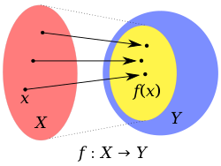
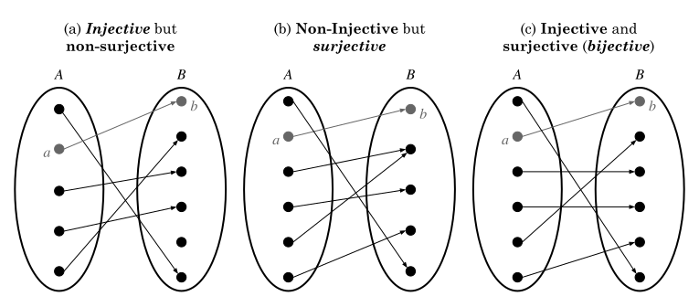

# Formal group theory

## Groups

  
  [https://crypto.stanford.edu/pbc/notes/group/group.html].
  
  We define a group $G^{\ast}$ as a set $G$ and a binary operation $\cdot$ having the following properties:

  1. For all $x, y \in G, x \cdot y \in G$. This is normally referred to as 'algebraic closure'.
  2. There exist an identity element $1 \in G$ such that $x \cdot 1 = x$ for all $x \in G$.
  3. The operation defined $(\cdot)$ is associative, that is, for all $x, y, z \in G$ we have $x(yz) = (xy)z$.
  4. For all $x \in G$ there exists an element $x^{-1}$ with $xx^{-1} = x^{-1}x = 1$ (the inverse). I proved this property here [https://github.com/Z323323/From-Fermat-to-the-group-theory?tab=readme-ov-file#proof-of-existence-and-uniqueness-of-inverses-in-z_p-and-z_phinast]. Note also that the formal definition of group doesn't imply we have a _finite_ group and it's therefore more general. The linked proof is about _finite_ multiplicative groups, which are the main interest for computer scientists.

  - If only $1,3$ holds for $G^{*}$ then $G^{\ast}$ is a semi-group.
  - If only $1, 2, 3$ holds for $G^{*}$ then $G^{\ast}$ is a monoid.

  In general if you see $G^{\ast}$ around in papers this will refer to a multiplicative group.

  If $G^{\ast}$ is commutative then

  5. For all $x, y \in G, xy = yx$

  and we call it _abelian_.

  ### Axioms

  1. Closure (not really trivial if you played around with Zn.py using $n$ non-prime).
  2. Associativity (trivial).
  3. Right and left cancellation:
     - $ax = bx$ iff $a = b$. This one is not that trivial if you think about _finite groups_ and therefore modular arithmetic [https://github.com/Z323323/From-Fermat-to-the-group-theory?tab=readme-ov-file#cancellation-law].
    
  ### Order

  The order of an element $g$ in a group $G$ is the smallest positive integer $k$ such that $g^{k} = 1$. We know this exists for all elements of $Z_{\phi(n)}^{\ast}$ (_finite groups_), while it doesn't for all elements of _infinite groups_ (holds only for $1$, at my current perspective).

  ### Subsets

  A subset $H$ of $G$ which satisfy the previous properties is called a subgroup of $G^{*}$. Every _finite group_ has two improper subgroups which are defined by the subsets $\\{1\\}$, and $G$. All other subgroups are defined as proper subgroups.

  We can write $H \leq G$ to refer to any subgroup of $G^{*}$ and if $H \neq G$ then $H < G$.
  

## Homomorphism, isomorphism, endomorphism, automorphism (and every other word which ends with 'morphism', jk)

  
  An homomorphism is a map $f : G &rarr; H$ between two different groups where

  $f(x)f(y) = f(xy)$

  for all $x, y \in G$. If $f$ is bijective then $f$ is called **isomorphism**.

  Let's clarify this concept, since it looks really abstract, and it is indeed, and it's also really important in math.

  First thing to understand is the meaning of **map**, and the different kinds of map in mathematics.
  
  1. **map** = **function**. A function is a map which associates elements from a set (**domain**) to some elements of another set (**codomain**). The actual elements mapped will be elements $\in$ **codomain**, which are called **image** of the function/map, and so we could have **image = codomain** or not.

  2. A map/function has $2$ foundation constraints which defines it.
     - It can't have two mappings starting from the domain, it's exactly one map for every element of the domain, while it can for example has two elements which map the same element of the codomain/image.
     - Every element of the domain must be mapped (it's not true for the codomain).

  4. A map/function has different properties which define it's structure, it can be
     - **Surjective**: Every element of the codomain is mapped.
     - **Injective**: Every element of the domain maps $1$ and only $1$ element of the codomain.
     - **Bijective**: If it's both surjective and injective.

  Now let's get back to our omomorphism definition. An omomorphism is a particular mapping/function where its definition holds, that is, where the mapping $G &rarr; H$ is defined as

  $x \in G &rarr; H, y \in G &rarr; H = x \cdot y \in G &rarr; H$

  
    
   

  
  
  Since I don't want to write the definitions of surjective, injective and bijective I'll just provide the image below where you can extract the meaning of all of them.

  

  

  #### Example

  Imagine the _infinite group_ $G$ defined over the integers towards infinity and $G_n$ being a _finite group_ of order $n - 1$, we have

  $G = (\\{1, 2, \dots, \infty \\}, \times)$ 
  $G_n = (\\{1, 2, \dots, n - 1 \\}, \times)$

  We define the omomorphism $f : G &rarr; G_n$ where $f(x) = x$, then we have

  $

  ## Some basic theorems collapsed

  
  #### 1

  If $g \in G$ has order $o$, then $x^{m} = 1$ iff $o | m$. This is a direct consequence of [https://github.com/Z323323/Group-theory-elements?tab=readme-ov-file#proof-of-cyclicness-of-subgroups-and-uniqueness-of-each-element].

  #### 2

  If $x \in G$ has order $mn$, where $m, n$ are coprime, then $x$ can be uniquely expressed in the form $x = uv$ where $u$ has order $m$ and $v$ has order $n$. This can be checked at [https://github.com/Z323323/Chinese-remainder-theorem?tab=readme-ov-file#example], but can be proved by choosing $a, b$ such that $am + bn = 1$ (Bezout's Identity) and picking $v = x^{am}$ and $u = x^{bn}$ such that $uv = x$. This can be understood both figuring out that nth-roots in multiplicative groups are like 'going back' wheter powers are 'going forward' or by implying $am + bn \equiv 1 \mod mn$ where $a, b \in Z_{mn}^{*}$.

   #### 3

   A non-empty subset $H$ of $G$ is a subgroup of $G$ iff $H$ is closed under multiplication (1). This one is a little bit tricky because of its statement. Get this: every subgroup $H$ is generated by some $g \in H$, now imagine to remove some element from its set, you'll find out is not algebraically closed anymore.

   #### 4 

   A non-empty subset $H \subset G$ is a subgroup iff $H^{2} \subset H$. To get this imagine $H$ not being a subgroup of $G$. We have that $e^{2} \not\in H$ for some element $e \in H$ and therefore $H$ not being a subgroup of $G$.

   #### 5

   For a subgroup $H$, for all $h \in H$ it must be that $hH = H = Hh$. Following [https://github.com/Z323323/Group-theory-elements?tab=readme-ov-file#multiplicative-groups-cyclic-subgroups-and-generators] $h$ must be some power of $e$ where $e$ is a generator for the subgroup; the lemma follows.

   #### 6

   For any set $S \subset H$, $SH = H = HS$. This is exactly the same logic of the previous one.

   #### 7

   A non-empty subset $H \subset G$ is a subgroup iff $H^{2} = H$. Follows from (4).

   #### 8

   Let $g \in G$ and $H \leq G$, then $g^{- 1}Hg$ is a subgroup of $G$ isomorphic to $H$.
    

  

